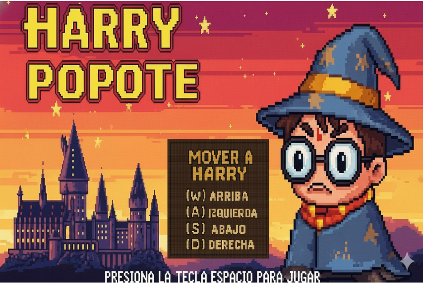
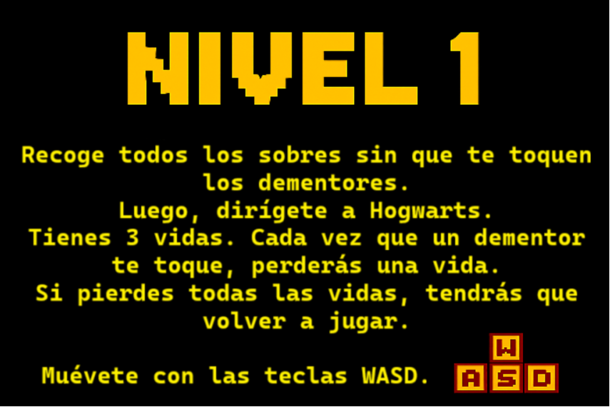
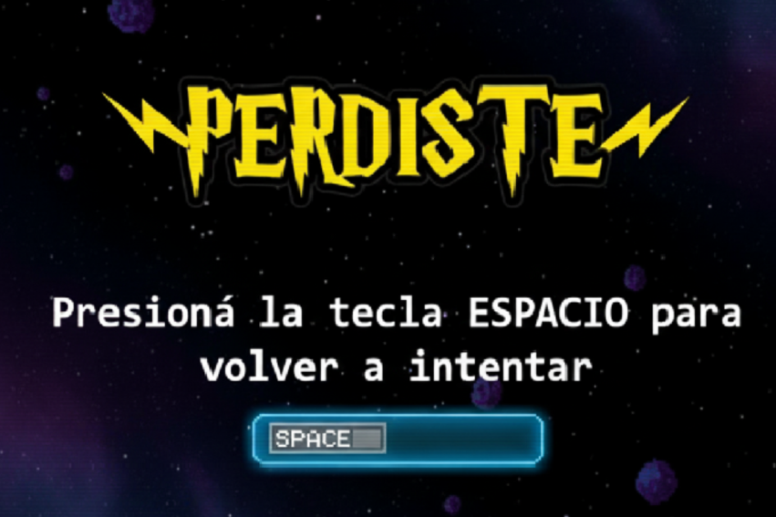
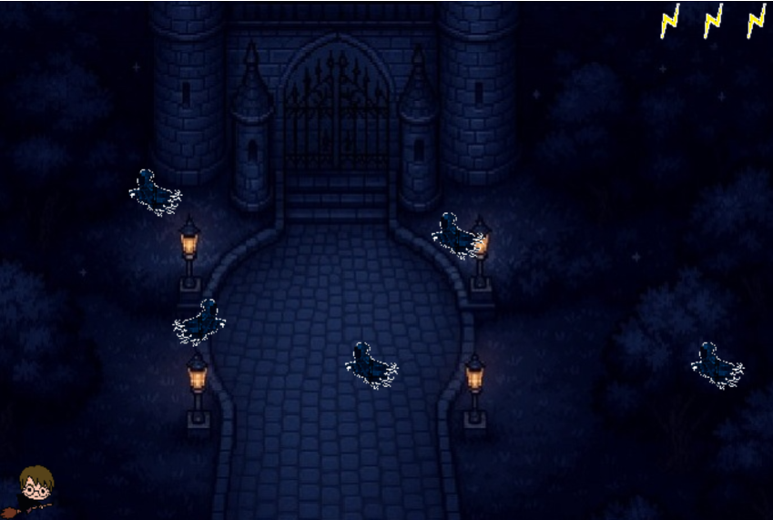
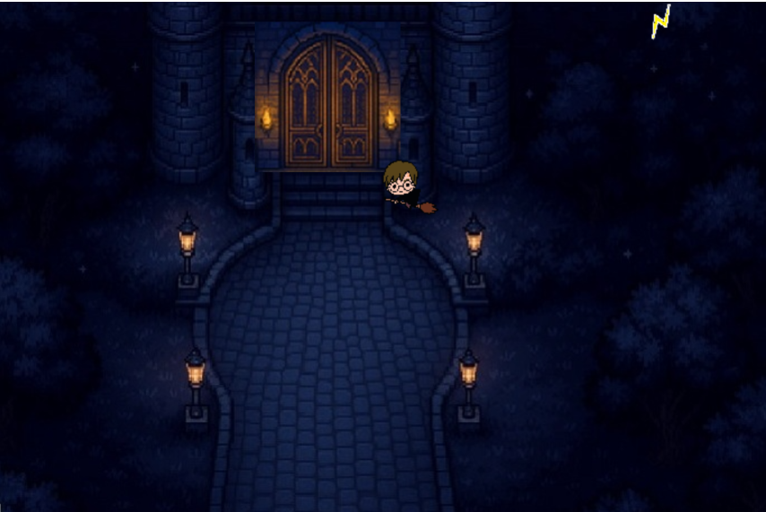

# Harry Popote 

## Equipo de desarrollo

- CIVIDINO, JUAN EMILIO
- FORTE, BRYAN DANIEL
- GARCÍA MÉNDEZ, MARÍA ANGÉLICA
- GUTIERREZ, PIERRE ANTHONY
- PIZZERA, CAMILA BELÉN

## Capturas

## Reglas de Juego / Instrucciones

El juego consta de 2 niveles y una pantalla de cierre

Nivel 1: En este nivel, deberás llevar a Harry hacia Hogwarts. Para poder llegar, deberás capturar las 2 invitaciones que aparecerán en pantalla. ¡Pero cuidado! Los dementores te querrán atrapar y deberás esquivarlos. Si un Dementor toca a Harry, perderá una de sus tres vidas. Si pierde las tres, el juego se reiniciará. Esquivá a estas criaturas para asegurar tu llegada.

Nivel 2: En este nivel, Harry desbloquea su magia más poderosa: el encantamiento Patronus. Presioná la tecla B para invocarlo y deshacerte de los Dementores, este hechizo solo puede ir hacia la dirección en la que Harry está mirando (izquierda o derecha). Una vez eliminados, uno de los dementores revelará la llave oculta, usala para abrir la puerta e ingresar a Hogwarts.

Cuando Harry ingrese a Hogwarts, se encontrará con sus amigos, primero deberá ir a buscar a Hermione y luego a Ron, momento en el que ganarás el juego.

## Controles

Movimientos: 

A: Izquierda

W: Arriba

S: Abajo

D: Derecha

B: Patronus

Espacio: iniciar juego / saltar instrucciones

## Otros

- Universidad Nacional de Hurlingam
- Facultad de Tecnología e Ingeniería
- Materia: Programación Orientada a Objetos I
- Comisión 2 - 2° cuat 2025
- Versión de wollok: 1.0.2
- Una vez terminado, no tenemos problemas en que el repositorio sea público / queremos manternerlo privado
